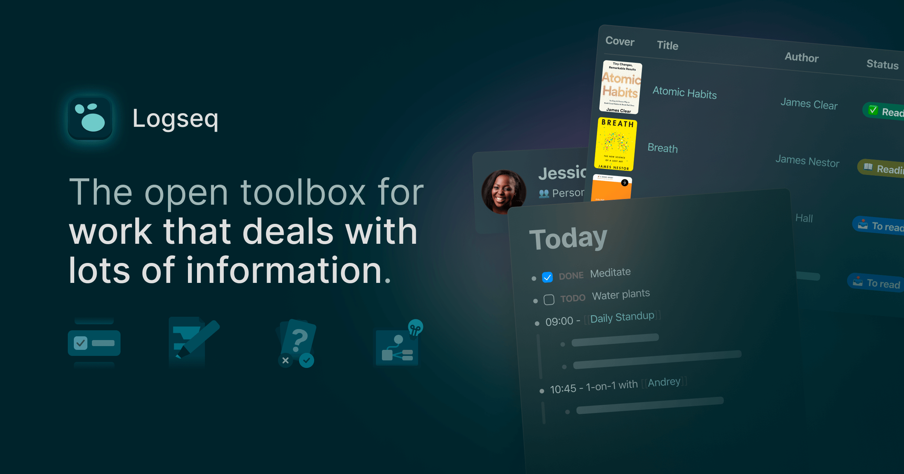
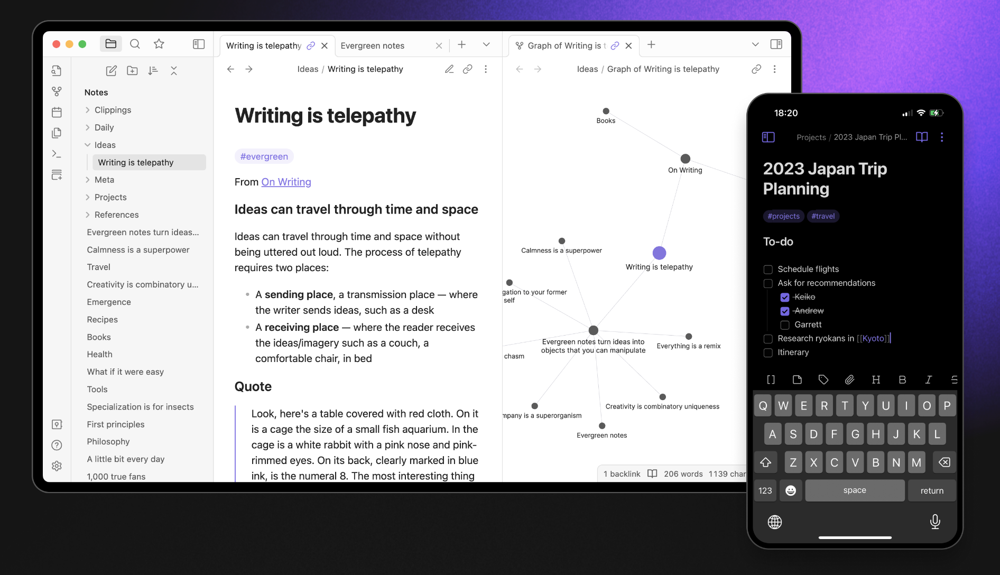
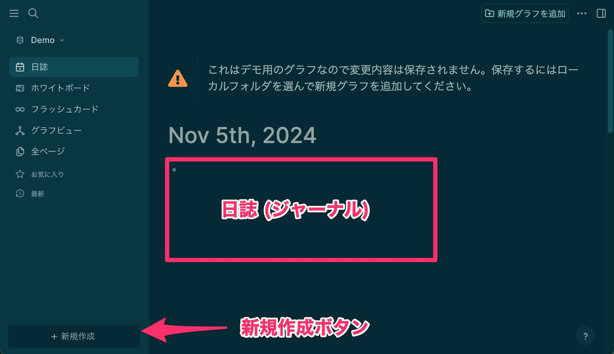

 [^g1]

[Logseq](https://logseq.com/)というツールをご存知でしょうか。

私は初めてLogseqに出会ったときは、正直とても面食らって、自分には全然合ってないツールだと思ったものですが、今では「第二の脳」ともいえるほど、なくてはならないものになりました。

この記事を通して、少しでもLogseqの良さがわかってもらえるようになれば幸いです。

## はじめに: Obsidianとの違いからみた、Logseq

Logseqを知らない人でも、[Obsidian](https://obsidian.md/)を知っている人は多いかもしれません。Obsidianはわかりやすくいえば、シンプルなマークダウン（テキスト）エディタでもあり、Evernoteの代替になるものでもあり、自分用のWikiを作れるものでもあります。

 [^g2]

### (比較表)

||Logseq|Obsidian|
|-|------|--------|
|[ローカルファースト](#ローカルファースト)| &check;[^1]|&check;|
|[Markdown](#markdown)|&check;[^s4]|&check;|
|[拡張機能](#拡張機能)|&check; (スマホ・タブレット版は現状非対応)|&check;|
|[TODO](#todo)|&check;|拡張機能: [Tasks](https://github.com/obsidian-tasks-group/obsidian-tasks)|
|[ホワイトボード](#ホワイトボード)|&check;|&check;|
|[フォルダ(階層)](#フォルダ階層構造の有無)|&cross;[^n1]|&check;|
|[基本単位](#基本単位の違いページブロック)|ブロック|ページ[^p3]|
|[クエリ](#クエリ-advanced-query)|&check;|拡張機能: [Dataview](https://github.com/blacksmithgu/obsidian-dataview)|
|[動作基盤](#動作基盤-ベースシステム-の違い)|グラフDB (現状はMarkdownファイル + インデックス) |Markdownファイル|

:::note warn
この章ではまずざっとLogseqとObsidianの違いを挙げていきますが、**読み飛ばしても問題ありません**。（→ [次の章](#logseq-再-入門)）
:::

### ローカルファースト

Obsidianは、**ローカルファースト**という考え方を打ち出していて、Evernoteなどがサーバ (クラウド) があることを前提に動いているのに対して、Obsidianは自分の手元のパソコンやスマホだけでも保存や編集をすることができますし、[Obsidian Sync](https://obsidian.md/sync)を使わなくても、GitやDropboxやiCloud Driveなどを使って、自分でファイルを同期することもできます。

Logseqも、Obsidianと同じ**ローカルファースト**のツールです[^1]。つまり、特に課金などは必要ないし、Obisidianと同じようにパソコンやスマホから使え、自分の好きなツールで同期することができます。

### Markdown

ObsidianもLogseqも、どちらもMarkdown記法に対応しています。[^s4]

### 拡張機能

Obsidianとの機能的な違いとしては、執筆時点現在、Logseqはスマホ版やタブレット版では拡張機能が使えないというのは個人的に大きいです。

（記事を読んでもらえばわかりますが、もちろん基本機能だけで済むようには設計されています。）

逆にObsidianの方が珍しいのですが、Obsidianではスマホやタブレットでもパソコンと同じような拡張機能が使えて、標準にはないような機能（例えばNotionのようなデータベースやカンバンを作るなど）を増やすことができます。もちろんLogseqでもパソコンでは拡張機能を使うことができます。

余談ですが、[Trello](https://trello.com/)というWebサービスがObsidianのように拡張機能が満載で、そのためにメンバーみんなが拡張機能をインストールしなければならない事態が多くあったのに対して、[Taskworld](https://taskworld.com/)が拡張機能なしで使えることをウリにしていたことがありました。個人的にはこの構図と若干似ているような気もしています。

### TODO

Logseqは、TODO管理の機能を標準で搭載しています。これについては今回は触れませんが、進行中のタスクの管理、締切や優先度の管理など、とても便利に使うことができます。
 
(Obsidianでは、[Tasks](https://github.com/obsidian-tasks-group/obsidian-tasks)という拡張機能を使えば同等の機能が使えますね。)

### ホワイトボード

Logseqには、[Obsidian Canvas](https://obsidian.md/canvas)と同じようなホワイトボード機能がついています。この機能については今回は触れませんが、思考整理につかったり、ピン留めに使ったり、図形を手描きしたり、非常に便利に使うことができます。

### フォルダ（階層構造）の有無

Logseqは、Obsidianと違って基本的にフォルダはありませんが、後述するタグやクエリなどの機能を使って補うことができます。[^n1]

（逆にフォルダなどの階層が固定化されていないことが、実はLogseqの強みであったりもします。）

### 基本単位の違い（ページ、ブロック）

LogseqとObsidianの執筆機能自体は、実はそこまで大差ありませんが、後述するクエリ（Advanced Query）などで扱われる基本単位が、Logseqは **ページ単位** ではなく **ブロック単位** が基本です。[^p3]

これがLogseqの魅力の一つでもあるのですが、今回の入門記事では、**あえてページ単位で使う方法から入って**、Obsidianとの違いを少しずつ楽しんでもらえればと思っています。

### クエリ (Advanced Query)

LogseqとObsidianの最大の違いは、**クエリ (Advanced Query)** にあります。（クエリとは、検索結果をページ内に埋め込む機能です。）

クエリについては、記事中で少しずつ触れていこうと思います。

### 動作基盤 (ベースシステム) の違い

Obsidianが、基本はシンプルなファイル構造のMarkdownエディタでありながら、拡張機能でデータ検索等ができるのに対し、LogseqはMarkdownエディタやWikiのような皮を被った、**グラフデータベース**であるという違いがあります。

（ただし現状の実装では、Markdownファイルにインデックスを追加した、少し理想とは違う実装になっており、拡張性や速度、スケーラビリティなどに問題があるので[DB版](https://discuss.logseq.com/t/why-the-database-version-and-how-its-going/26744)が水面下で開発されています。）

特に今後発表される[DB版](https://discuss.logseq.com/t/why-the-database-version-and-how-its-going/26744)では、Logseqの持つグラフデータベースとしての特徴がさらに活かされ、まるで[Notion](https://www.notion.com/ja)のように、Markdownも一応出力できる、複数人でも使えるサーバウェア（サービス）として発展していくのではないかと予想されています。（今のようなアプリ版もきっと残されると個人的に期待はしています。）

---

## Logseq (再) 入門

さて、ここからは実際にLogseqを触っていきます。【レベル1】〜【レベル4】に分けていますが、好きなレベルで止めて、そのままLogseqを使ってもらっても構いません。（全ての機能を知っておく必要はありませんので。）

## 【レベル1】 まずObsidianと同じように使う

Logseqが何なのかを考えるより、まずObsidianと同じように使ってみるのが早道です。実際に手を動かしてみることにしましょう。

:::note
Logseqはアプリをダウンロードしなくても、[demo.logseq.com](https://demo.logseq.com/)を**ブラウザから開けば試用することができます**。今回はこれを使って説明していきます。
:::

Logseqは、開くとすぐ **日誌（ジャーナル）** が表示されますが、ここではひとまず**無視**しましょう。

左下に「＋新規作成」というボタンがあるので、こちらを使って、好きな名前で新規ページを作ります。

 

:::note warn
以降、パソコン版の画面を基本に操作説明を行いますが、スマホ・タブレットからも**アプリ**を使うと同じ操作が可能です。

[demo.logseq.com](https://demo.logseq.com/)をスマホから開くと、UIが若干異なる部分もあるため、スマホ版はアプリからの利用をおすすめします。
:::

新規作成から「新規ページ」を選んだあと、適当な名前を打って「Create Page」を選びます。（二度手間なのは御愛嬌です。）


これで新しいページが作られました。やったね。


これでもうObsidianと同じように使う方法は完璧です。

## 【レベル2】 ページのタグ付け

新しいページにあれやこれや入力してみても良いのですが、最初のステップとして、**タグ**を付けてみることにしましょう。

ページの最初の段落に、`tags:: 適当`と打ちます。（半角スペースを忘れずに！）


そして、その下あたりの適当な空欄をクリックすると、たった今入力したものが色付きでハイライトされます。

（※ ハイライトされない場合は入力ミスがあります。全角半角等に注意。）


ハイライトされている、今作ったタグ（ここでは「適当」）をクリックすると、そのページに飛ぶことができます。

そしてそのページには、今作ったばかりのページ名がちゃんと含まれています。


これで、作ったページにタグを付ける方法がわかりました。これだけでも便利ですね。

## 【レベル3】 クエリを書いてみる

ではここからがLogseqの真骨頂というべきなのですが、この「適当」というページに、**クエリ (Advanced Query)** というものを書いてみます。

クエリというのは、Google検索のように好きなもの（ここではページタグ）を検索して、しかも**その結果をテーブルや一覧などでそのまま埋め込むことができる**という機能です。

（Obsidianをご存じの方は、[dataview](https://github.com/blacksmithgu/obsidian-dataview)という拡張機能と同じものだと思ってもらえれば良いかと思います。）

ちょっと長いですが、以下の中身をそのままコピーして、「適当」というページにそのまま貼り付けます。

```cljs
#+BEGIN_QUERY
 {:title [:b"#適当"]
 :query (or (page-tags "適当") )
 }
#+END_QUERY
```

そして、その下の空欄などを適当にクリックすると、新しいテーブルが表示されると思います。


今回は自動的にテーブルとして表示されましたが、内容によっては一覧表示と切り替えることもできます。

もうおわかりかと思うのですが、実は**ページに付けた属性**がこの表には表示されます。属性というのは、先ほどつけた `tags:: `のように、ページの冒頭に `xxx::` の形式で入力したものです。

しかもこの属性というのは、自分の好きなものを入力することができます。例えば住所録のように使うこともできるし、好きな映画データベースとして、映画の評価（例えば `rate:: 5` など）を付けていくこともできます。

なお、表示させたくない余計な属性は、歯車アイコンから表示・非表示を切り替えることができます。


## 【レベル4】 クエリはブロック単位で使える

さて、ここまででもう十分お腹いっぱい、という人も多いかと思いますが、ここまでだと正直Obsidianにdataviewプラグインを入れたものとそう変わりはありませんね。

でも実はLogseqは、ページ単位でこうした操作が行えるだけではなくて、**ブロック単位**でこの操作が行えます。[^p3]

ブロックというのは、わかりやすくいえばTwitterの一行と同じものだと思ってもらえればよく、ハッシュタグなどを含めた次のような一行をイメージしてもらえれば十分です。

> Logseqよくわからん #つぶやき #嘆き

実は、前述のクエリではあえて「ページ」単位だけが検索結果に引っかかるようにしただけで、Logseqのクエリは基本的に「ブロック」単位で行われます。

例えば `#つぶやき` や `#嘆き` というハッシュタグを含む結果を一覧表示させたいときは、次のようなクエリを書きます。

```cljs
#+BEGIN_QUERY
{:title [:b"#つぶやき, #嘆き"]
 :query (or [[つぶやき]] [[嘆き]])
:breadcrumb-show? false
}
#+END_QUERY
```


ちなみに「歯車アイコン」と同じく「テーブルアイコン」をクリックすると、さっきのようなテーブル表示にすることもできます。


これで、Logseqがなぜ日誌（ジャーナル）を基本ページにしているかがわかっていただけると思います。つまり、日誌の各行にツイッターのようにハッシュタグ付きで適当なつぶやきを書き殴っていけば、**あとからクエリで整理することがいつでもどこでもできる**のです。

これはもちろん必須ではなくて、他のツールから来ている人にとっては、先の例の「ページ」単位の方がわかりやすいと思います。使い方は自由です。[^2]

## 補足: クエリを書かなくても大丈夫

ちなみにこのハッシュタグみたいなものも実は必須ではなくて、ページを作るとそのページタイトルの言葉（例えば `つぶやき`）が自動的に検索されて、「Unlinked References」（非リンク参照）という欄にまとめられます。これもLogseqの便利なところです。


クエリを自分で一切書かなくても、このように「Linked References」（リンク参照）と「Unlinked References」（非リンク参照）にまとめられるので、これだけでもかなり便利だと思います。

## まとめ

Logseqの本当の魅力を知ってもらいたいなと思い、できるだけわかりやすいようにObsidianとの比較を通して紹介しました。

ちなみにLogseqのクエリは、[ClojureScript](https://clojurescript.org/) (cljs) という[Clojure言語](https://ja.wikipedia.org/wiki/Clojure)の一種になっていて、SQLなどのような一般的なものとは少し違います。

ここは好みが大きく分かれるところと思いますが、実はLogseqは**DB版**というものが今現在水面下で開発されていて、いずれはそちらが正式公開され、標準になると思われます。

DB版はクローズド（非公開）で開発されていて、[動向](https://discuss.logseq.com/t/why-the-database-version-and-how-its-going/26744)は正直よくわからない部分も多く含まれているのですが、DB版が正式公開されれば、より一般的にわかりやすいクエリが書けるようになったり（あるいはUI操作でできるようになったり）、[Notion](https://www.notion.com/ja)のように複数人での協業ができるようになったりなどが期待されています。

DB版が今と同じようなオープンソースになるのか、商用版プランが出るのかなどは不明ですが、今後の動向に注目ですね。

（参考記事↓）

https://note.com/p510hv/n/nbc18227893ce

[^g1]: 画像出典は[Logseq公式サイト](https://logseq.com/)より。

[^g2]: 画像出典は[Obsidian公式サイト](https://obsidian.md/)より。

[^1]: ただし、現在クローズドで開発されている[Logseq DB版](https://discuss.logseq.com/t/why-the-database-version-and-how-its-going/26744)は必ずしもそうではないので、あくまで執筆時点での認識です。

[^2]: 日誌（ジャーナル）機能は実はオフにすることもできますが、Logseqにはフォルダがないので、各ページを整理したい場合はタグやクエリなどを使って整理していくか、フォルダにあたるような階層を持つページを自分で作る必要が出てきます。（また、クエリの検索結果にブロックが含まれないようにする工夫なども必要になってきます。）また、TODO機能など日誌がないと不便になる機能も多くあります。

[^p3]: (追記) [Obsidian Dataview](https://github.com/blacksmithgu/obsidian-dataview)でも同じくブロック単位のクエリ操作ができるようです。（参考: [Sources - Obsidian Dataview](https://blacksmithgu.github.io/obsidian-dataview/reference/sources/)）

[^n1]: タグには`/`(スラッシュ)も使えるので、これをNamespace (名前空間)と呼んで活用している人もいるようです。「Logseq Namespace」で検索するといくつか情報が出てきます。

[^s4]: LogseqはDB版の開発が進んでおり、今後はMarkdownファイルベースではなくなると見られていますが、Markdown記法自体への対応は続くと思います。
